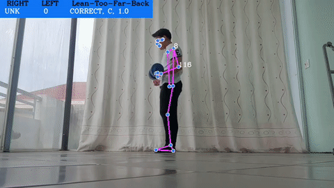

<div align="center">

```
███████╗██╗  ██╗███████╗██████╗  ██████╗██╗███████╗███████╗
██╔════╝╚██╗██╔╝██╔════╝██╔══██╗██╔════╝██║██╔════╝██╔════╝
█████╗   ╚███╔╝ █████╗  ██████╔╝██║     ██║███████╗█████╗
██╔══╝   ██╔██╗ ██╔══╝  ██╔══██╗██║     ██║╚════██║██╔══╝
███████╗██╔╝ ██╗███████╗██║  ██║╚██████╗██║███████║███████╗
╚══════╝╚═╝  ╚═╝╚══════╝╚═╝  ╚═╝ ╚═════╝╚═╝╚══════╝╚══════╝
```

```
 ██████╗ ██████╗ ██████╗ ██████╗ ███████╗ ██████╗████████╗██╗ ██████╗ ███╗   ██╗
██╔════╝██╔═══██╗██╔══██╗██╔══██╗██╔════╝██╔════╝╚══██╔══╝██║██╔═══██╗████╗  ██║
██║     ██║   ██║██████╔╝██████╔╝█████╗  ██║        ██║   ██║██║   ██║██╔██╗ ██║
██║     ██║   ██║██╔══██╗██╔══██╗██╔══╝  ██║        ██║   ██║██║   ██║██║╚██╗██║
╚██████╗╚██████╔╝██║  ██║██║  ██║███████╗╚██████╗   ██║   ██║╚██████╔╝██║ ╚████║
 ╚═════╝ ╚═════╝ ╚═╝  ╚═╝╚═╝  ╚═╝╚══════╝ ╚═════╝   ╚═╝   ╚═╝ ╚═════╝ ╚═╝  ╚═══╝
```

### AI-Powered Exercise Form Analysis · Real-Time Pose Estimation · Multi-Set Analytics


</div>

---

## 🧠 What Is This?

**Exercise Correction** is a full-stack computer vision application that watches you work out and tells you when your form breaks down — in real time.

It combines **MediaPipe's 33-point body pose estimation** with **trained Scikit-Learn classifiers** to detect exercise stages, count reps, identify specific form errors, and generate per-session analytics — all without sending data to any third-party service.

```
Webcam / Video  →  MediaPipe Pose  →  ML Classifier  →  Error Detection  →  Annotated Output
      📷                🦴                  🤖                  ⚠️                   📊
```

> Supports **Squat**, **Plank**, **Bicep Curl**, and **Lunge** — with live webcam streaming or pre-recorded video upload.

---

## 🎬 Live Demo

<div align="center">

<table>
<tr>
<th align="center">🦵 Squat</th>
<th align="center">🧘 Plank</th>
</tr>
<tr>
<td align="center">


</td>
<td align="center">


</td>
</tr>
<tr>
<th align="center">💪 Bicep Curl</th>
<th align="center">🚶 Lunge</th>
</tr>
<tr>
<td align="center">



</td>
<td align="center">


</td>
</tr>
</table>

</div>

---

## ✨ Key Features

| Feature | Description |
| :--- | :--- |
| 🎥 **Real-Time Detection** | Webcam stream at ~7 FPS via WebSocket |
| 📁 **Video Upload** | Process pre-recorded `.mp4` / `.webm` files |
| 🦴 **Pose Estimation** | MediaPipe 33-landmark body skeleton |
| 🤖 **ML Form Analysis** | Trained Scikit-Learn classifiers per exercise |
| 🔢 **Rep Counting** | Automatic stage-based repetition tracking |
| ⚠️ **Error Detection** | Geometric + ML-based error identification |
| 📸 **Error Screenshots** | JPEG snapshots captured at error frames |
| 📦 **Multi-Set Sessions** | 1–5 sets with fatigue index & trend analysis |
| ⚡ **GPU Acceleration** | Optional Hummingbird-ML + CUDA 12.1 support |

---

## 🏗️ Architecture

```
┌────────────────────────────────────────────────────────────────────┐
│                         BROWSER  (Vue 3)                           │
│                                                                    │
│    Home.vue            VideoStreaming.vue          RealTime.vue    │
│   (Mode Select)       (Upload + Multi-Set)       (Webcam + WS)     │
└──────────┬─────────────────────────────────────────┬──────────────┘
           │  HTTP / REST  (Axios)                   │  WebSocket
           ▼                                         ▼
┌────────────────────────────────────────────────────────────────────┐
│                    DJANGO  (Daphne / ASGI)                         │
│                                                                    │
│    stream_video/views.py            stream_video/consumers.py      │
│   (upload, session, aggregate)      (ExerciseStreamConsumer)       │
└──────────────────────────┬─────────────────────────────────────────┘
                           │
               ┌───────────▼────────────┐
               │    detection/  (ML)    │
               │                        │
               │    MediaPipe Pose      │
               │          ↓             │
               │   Feature Extraction  │
               │          ↓             │
               │   sklearn .predict()  │
               │          ↓             │
               │   Geometric Analysis  │
               └───────────┬────────────┘
                           │
               ┌───────────▼────────────┐
               │      services.py       │
               │   Multi-Set Analytics  │
               │   SQLite via Django ORM│
               └────────────────────────┘
```

---

## 🏋️ Supported Exercises

<details>
<summary><strong>🦵 Squat</strong> — Stage + Foot/Knee Placement Analysis</summary>

<br>

```
Model:      squat_model.pkl  (~187 KB)
Landmarks:  9  (nose, shoulders, hips, knees, ankles)
Features:   36  (9 × x, y, z, visibility)
```

**Detects:**
- ✅ Stage: `up` / `down` (rep counting at confidence ≥ 0.7)
- ⚠️ Feet too narrow (`ratio < 1.2`) or too wide (`ratio > 2.8`)
- ⚠️ Knee collapse or bow-out (stage-dependent thresholds)

**Fallback Counting:** Knee angle oscillation — peaks below 140° / above 160°

**📊 Model Evaluation:**

| # | Model | Precision | Accuracy | Recall | F1 Score |
|---|-------|-----------|----------|--------|----------|
| 🥇 | **LR** | **0.9941** | **0.9941** | **0.9941** | **0.9941** |
| 🥈 | SGDC | 0.9931 | 0.9930 | 0.9930 | 0.9930 |
| 🥉 | KNN | 0.9852 | 0.9848 | 0.9848 | 0.9848 |
| | SVC | 0.9776 | 0.9766 | 0.9766 | 0.9765 |
| | DTC | 0.2541 | 0.5041 | 0.5041 | 0.3379 |
| | NB | 0.2541 | 0.5041 | 0.5041 | 0.3379 |
| | RF | 0.2541 | 0.5041 | 0.5041 | 0.3379 |

> **Deployed model:** `LR` — Logistic Regression with **99.41% accuracy**

</details>

<details>
<summary><strong>🧘 Plank</strong> — Static Posture Classification</summary>

<br>

```
Model:      plank_model.pkl          (~2.4 KB)
Scaler:     plank_input_scaler.pkl   (~3.2 KB)
Landmarks:  17  (full upper + lower body)
Features:   68  (17 × x, y, z, visibility)
```

**Detects:**
- ✅ `C` → Correct form
- ⚠️ `L` → Hips sagging too low
- ⚠️ `H` → Hips raised too high

> No rep counter — plank is a static hold. Error frames are saved on form breaks.

**📊 Model Evaluation:**

| # | Model | Precision | Accuracy | Recall | F1 Score |
|---|-------|-----------|----------|--------|----------|
| 🥇 | **LR** | **0.9958** | **0.9958** | **0.9958** | **0.9958** |
| 🥈 | 7-layers + Dropout | 0.9945 | 0.9944 | 0.9944 | 0.9944 |
| 🥉 | SVC | 0.9878 | 0.9873 | 0.9873 | 0.9874 |
| | SGDC | 0.9817 | 0.9817 | 0.9817 | 0.9817 |
| | KNN | 0.9555 | 0.9493 | 0.9493 | 0.9493 |
| | 5-layers | 0.9347 | 0.9296 | 0.9296 | 0.9278 |
| | 7-layers | 0.9352 | 0.9239 | 0.9239 | 0.9230 |
| | RF | 0.9225 | 0.8986 | 0.8986 | 0.8962 |
| | 3-layers | 0.8692 | 0.8479 | 0.8479 | 0.8440 |
| | NB | 0.8568 | 0.8423 | 0.8423 | 0.8380 |
| | DTC | 0.7738 | 0.7676 | 0.7676 | 0.7654 |

> **Deployed model:** `LR` — Logistic Regression with **99.58% accuracy**

</details>

<details>
<summary><strong>💪 Bicep Curl</strong> — Per-Arm Independent Tracking</summary>

<br>

```
Model:      bicep_curl_model.pkl          (~3.6 MB — largest model)
Scaler:     bicep_curl_input_scaler.pkl   (~1.9 KB)
Landmarks:  9  (nose, shoulders, elbows, wrists, hips)
Features:   36  (9 × x, y, z, visibility)
```

**Detects:**
- ⚠️ **Lean-back error** (ML model, threshold ≥ 0.95)
- ⚠️ **Loose upper arm** (elbow swing > 40° from Y-axis)
- ⚠️ **Weak peak contraction** (elbow angle ≥ 60° at top)
- 🔢 Left & right arms tracked **independently** via `BicepPoseAnalysis`

> Rep counted when elbow goes from > 120° (down) to < 100° (up).

**📊 Model Evaluation:**

| # | Model | Precision | Accuracy | Recall | F1 Score |
|---|-------|-----------|----------|--------|----------|
| 🥇 | **KNN** | **0.9754** | **0.9719** | **0.9683** | **0.9712** |
| 🥈 | 7-layers | 0.9721 | 0.9663 | 0.9623 | 0.9661 |
| 🥉 | 5-layers | 0.9631 | 0.9553 | 0.9491 | 0.9540 |
| | SVC | 0.9300 | 0.9321 | 0.9338 | 0.9314 |
| | RF | 0.9472 | 0.9245 | 0.9246 | 0.9313 |
| | 7-layers + Dropout | 0.9359 | 0.9245 | 0.9245 | 0.9286 |
| | 3-layers | 0.9392 | 0.9205 | 0.9208 | 0.9264 |
| | LR | 0.7927 | 0.7616 | 0.7378 | 0.7406 |
| | SGDC | 0.7125 | 0.7152 | 0.7150 | 0.7129 |
| | DTC | 0.6843 | 0.6755 | 0.6505 | 0.6476 |
| | NB | 0.7974 | 0.6176 | 0.5642 | 0.4867 |

> **Deployed model:** `KNN` — K-Nearest Neighbors with **97.19% accuracy**

</details>

<details>
<summary><strong>🚶 Lunge</strong> — Dual-Model Stage + Error Pipeline</summary>

<br>

```
Stage Model:  lunge_stage_model.pkl   (~2.0 KB)
Error Model:  lunge_err_model.pkl     (~1.1 KB)
Scaler:       lunge_input_scaler.pkl  (~2.6 KB)
Landmarks:    13  (torso, hips, legs, feet)
Features:     52  (13 × x, y, z, visibility)
```

**Detects:**
- Stage: `I` (init) → `M` (mid) → `D` (down) at confidence ≥ 0.8
- ⚠️ **Knee-over-toe** error (ML model, down stage only)
- ⚠️ **Knee angle out of range** [60°–125°] (geometric, down stage only)

**📊 Model Evaluation:**

| # | Model | Precision | Accuracy | Recall | F1 Score |
|---|-------|-----------|----------|--------|----------|
| 🥇 | **LR** | **0.9733** | **0.9720** | **0.9720** | **0.9720** |
| 🥈 | SGDC | 0.9606 | 0.9575 | 0.9575 | 0.9575 |
| 🥉 | 3-layers | 0.9365 | 0.9277 | 0.9277 | 0.9274 |
| | DTC | 0.9192 | 0.9169 | 0.9169 | 0.9167 |
| | 7-layers + Dropout | 0.8921 | 0.8645 | 0.8645 | 0.8624 |
| | RF | 0.8545 | 0.8419 | 0.8419 | 0.8407 |
| | 5-layers | 0.8605 | 0.8311 | 0.8311 | 0.8280 |
| | NB | 0.7704 | 0.7687 | 0.7687 | 0.7682 |
| | KNN | 0.7684 | 0.7651 | 0.7651 | 0.7647 |
| | 7-layers | 0.8379 | 0.7733 | 0.7733 | 0.7627 |
| | SVC | 0.7519 | 0.7200 | 0.7200 | 0.7118 |

> **Deployed model:** `LR` — Logistic Regression with **97.20% accuracy**

</details>

---

## 📊 Model Performance Overview

<div align="center">

| Exercise | Best Model | Accuracy | Precision | Recall | F1 Score |
|:--------:|:----------:|:--------:|:---------:|:------:|:--------:|
| 🦵 **Squat** | Logistic Regression | **99.41%** | 99.41% | 99.41% | 99.41% |
| 🧘 **Plank** | Logistic Regression | **99.58%** | 99.58% | 99.58% | 99.58% |
| 💪 **Bicep Curl** | KNN | **97.19%** | 97.54% | 96.83% | 97.12% |
| 🚶 **Lunge** | Logistic Regression | **97.20%** | 97.33% | 97.20% | 97.20% |

</div>

---

## 📊 Multi-Set Session Analytics

After completing 1–5 sets, the system computes:

| Metric | How It's Calculated |
| :--- | :--- |
| `overall_score` | Weighted average of set scores by rep count |
| `consistency_score` | `100 - variance(scores)` across all sets |
| `fatigue_index` | `set_1_score - last_set_score` |
| `accuracy_trend` | `Improving` / `Declining` / `Stable` |
| `most_frequent_error` | Error type with highest cross-set frequency |
| `best_set` / `worst_set` | Set numbers with highest / lowest scores |
| `total_reps` | Sum of all sets |

**Per-set normalization via `NormalizedMetricExtractor`:**

```python
normalized_accuracy        = 100 - (10 × total_errors)
normalized_stability       = 100 - ( 5 × total_errors)
normalized_range_of_motion = 100 if errors == 0 else 85
set_score                  = normalized_accuracy
```

---

## ⚡ WebSocket Real-Time Flow

```
Client (150ms interval)                    Server (consumers.py)
───────────────────────────────────────────────────────────────────
connect()  ──────────────────────────────→  Initialize MediaPipe Pose
                                            Create detector registry

{ type:  "squat",            ──────────→   1. Lazy-load detector
  image: "data:image/..." }                 2. Decode base64 → OpenCV
                                            3. Rescale to 50%
                                            4. Run MediaPipe Pose
                                            5. detector.detect()
                                            6. Draw landmarks + errors
{ image:   "data:...",       ←──────────   7. Encode JPEG (quality 70)
  counter: 5 }

{ action: "stop" }           ──────────→   Build summary from history

{ msg_type: "summary",       ←──────────   Serialize errors, frames,
  details:  [...],                          counter state
  counter:  12 }
```

---

## 🗄️ Database Schema

### `Session`

| Field | Type | Description |
| :--- | :--- | :--- |
| `session_id` | UUID (PK) | Auto-generated identifier |
| `exercise_type` | CharField | `squat` / `plank` / `bicep_curl` / `lunge` |
| `overall_score` | Float | Weighted accuracy (0–100) |
| `consistency_score` | Float | Score variance metric (0–100) |
| `fatigue_index` | Float | First set vs last set delta |
| `accuracy_trend` | CharField | `Improving` / `Declining` / `Stable` |
| `total_reps` | Integer | Sum across all sets |
| `total_sets` | Integer | Number of sets analyzed |
| `timestamp` | DateTime | Session creation time |

### `SessionSet`

| Field | Type | Description |
| :--- | :--- | :--- |
| `session` | FK → Session | Parent session reference |
| `set_number` | Integer | 1–5 |
| `raw_report_json` | TextField | Full ML results payload |
| `set_score` | Float | Normalized accuracy (0–100) |
| `total_errors` | Integer | Error count for this set |
| `rep_count` | Integer | Reps detected in this set |

---

## 🌐 API Reference

```
BASE URL: http://127.0.0.1:8000
```

| Method | Endpoint | Description |
| :--- | :--- | :--- |
| `GET` | `/api/` | Health check |
| `POST` | `/api/video/upload?type={exercise}` | Upload video for ML processing |
| `GET` | `/api/video/stream?video_name={n}` | Stream processed video (chunked) |
| `POST` | `/api/video/session/start` | Create new multi-set session |
| `POST` | `/api/video/session/set/save` | Save individual set results |
| `POST` | `/api/video/session/aggregate` | Compute session analytics |

**WebSocket:**

```
ws://127.0.0.1:8000/ws/stream/

→ Send:   { "type": "squat",  "image": "data:image/jpeg;base64,..." }
← Recv:   { "image": "data:image/jpeg;base64,...", "counter": 5 }

→ Send:   { "action": "stop" }
← Recv:   { "msg_type": "summary", "type": "squat", "details": [...], "counter": 12 }
```

---

## 🚀 Getting Started

### Prerequisites

- Python **3.11** with `venv`
- Node.js **16+** and npm
- *(Optional)* NVIDIA GPU with CUDA 12.1 for hardware acceleration

### 1 — Clone & Install

```bash
git clone https://github.com/your-username/Exercise-Correction.git
cd Exercise-Correction

# Python dependencies
venv\Scripts\python -m pip install -r requirements.txt

# Frontend dependencies
npm run install:client
```

### 2 — Run Development Servers

```bash
# Terminal 1 — Django backend (port 8000)
npm run dev:server

# Terminal 2 — Vite frontend (port 5173)
npm run dev:client
```

### 3 — Open in Browser

```
http://localhost:5173
```

- 📷 **Real Time** → Webcam-based live detection
- 📁 **Video Upload** → File-based detection + multi-set analysis

---

## 🐳 Docker Deployment

```bash
# Build
docker build -t exercise-correction .

# Run
docker run -e VITE_BASE_URL=http://127.0.0.1 -p 80:8000 exercise-correction

# Access
open http://127.0.0.1
```

---

## ⚙️ Configuration Reference

| Setting | Location | Default | Purpose |
| :--- | :--- | :--- | :--- |
| `VITE_BASE_URL` | `web/client/.env` | `http://127.0.0.1:8000` | Django API URL for frontend |
| `OPENBLAS_NUM_THREADS` | npm `dev:server` script | `1` | Prevents multi-model thread crashes |
| `--noreload` | Django runserver flag | — | Stops double-loading ML models |
| Pose confidence | `main.py`, `consumers.py` | `0.8` | MediaPipe detection threshold |
| Video rescale | upload / websocket | `40%` / `50%` | Frame resolution reduction |
| WS frame rate | `RealTime.vue` | `150ms` (~6.7 FPS) | WebSocket send interval |
| WS JPEG quality | client / server | `60%` / `70%` | Compression settings |

---

## 🛠️ Technology Stack

<table>
<tr>
<th align="center" width="33%">Frontend</th>
<th align="center" width="33%">Backend</th>
<th align="center" width="33%">ML / AI</th>
</tr>
<tr>
<td valign="top">

- Vue.js 3 (Composition API)
- Vue Router 4
- Vite 3
- Axios
- Pinia
- SCSS
- Native WebSocket API

</td>
<td valign="top">

- Python 3.11
- Django 4.1.2
- Django REST Framework 3.14
- Django Channels + Daphne
- Django CORS Headers
- SQLite 3

</td>
<td valign="top">

- MediaPipe 0.10.33
- Scikit-Learn (.pkl models)
- OpenCV 4.13
- NumPy 2.4.4
- Pandas
- PyTorch + CUDA *(optional)*
- Hummingbird-ML *(optional)*

</td>
</tr>
</table>

---

## 📁 Project Structure

```
Exercise-Correction/
│
├── core/                            # 📓 Model training notebooks
│   ├── squat_model/
│   ├── plank_model/
│   ├── bicep_model/
│   └── lunge_model/
│
├── images/                          # 📊 Model evaluation matrices + GIFs
│   ├── squat_eval_3.png
│   ├── plank_eval_3.png
│   ├── bicep_curl_eval_3.png
│   ├── lunge_eval_3.png
│   ├── squat.gif
│   ├── plank.gif
│   ├── bicep_curl.gif
│   └── lunge.gif
│
└── web/
    ├── client/                      # 🖥️  Vue 3 SPA
    │   └── src/
    │       ├── views/
    │       │   ├── Home.vue
    │       │   ├── VideoStreaming.vue
    │       │   └── RealTime.vue
    │       └── components/
    │           ├── Dropzone.vue
    │           ├── Result.vue
    │           └── Video.vue
    │
    └── server/                      # ⚙️  Django backend
        ├── detection/               # 🤖 ML inference engine
        │   ├── main.py              #    Orchestrator + lazy loader
        │   ├── utils.py             #    Angle/distance helpers
        │   ├── squat.py
        │   ├── plank.py
        │   ├── bicep_curl.py
        │   └── lunge.py
        ├── stream_video/            # 📡 API + WebSocket + DB
        │   ├── views.py
        │   ├── consumers.py
        │   ├── models.py
        │   └── services.py
        └── static/
            └── model/               # 📦 Serialized .pkl models
```

---

<div align="center">

Built with 🏋️ for better workouts · Powered by **MediaPipe** + **Scikit-Learn**


</div>
